# Snowboard Kids on the Power Mac G4

A native PowerPC port of the [Snowboard Kids decompilation](https://github.com/cdlewis/snowboardkids-decomp)
for a Quicksilver G4 running Mac OS X 10.5 with a Radeon 9000. The game sources
are untouched; everything lives in this `port/` directory: a libultra
replacement, an interpreter for the display lists and the audio command lists,
a fixed-function OpenGL 1.3 backend, scripted input.

  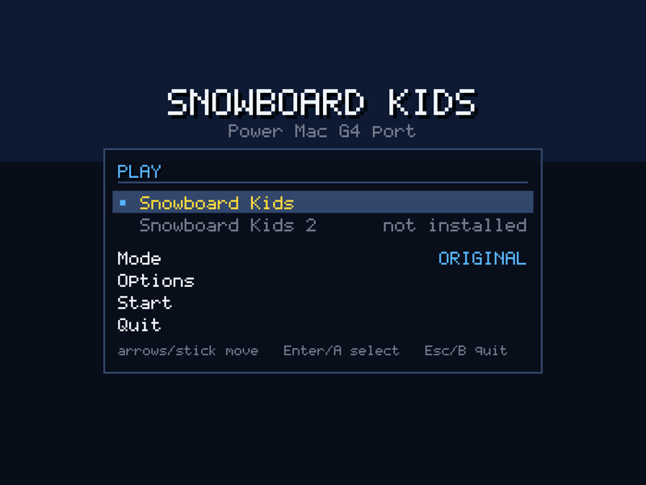
  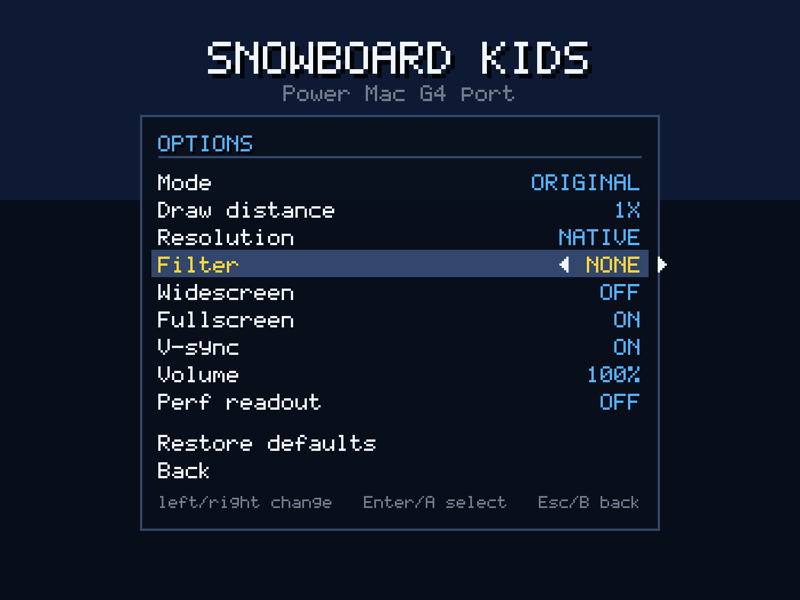
  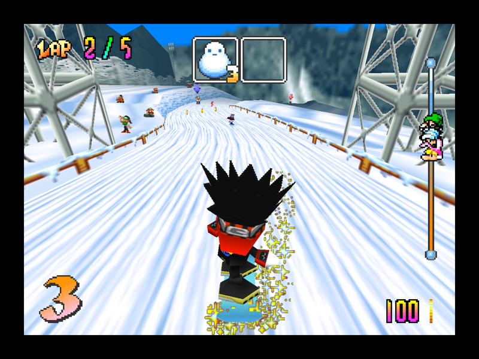
  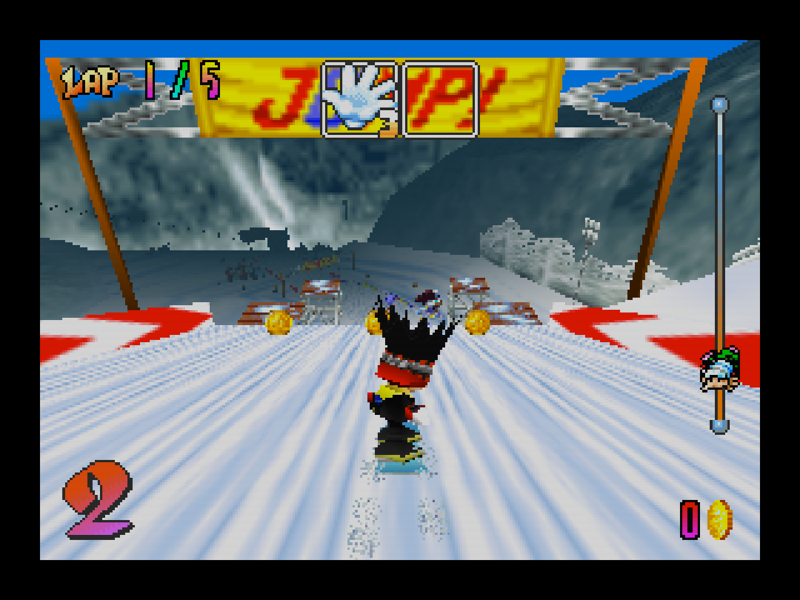
  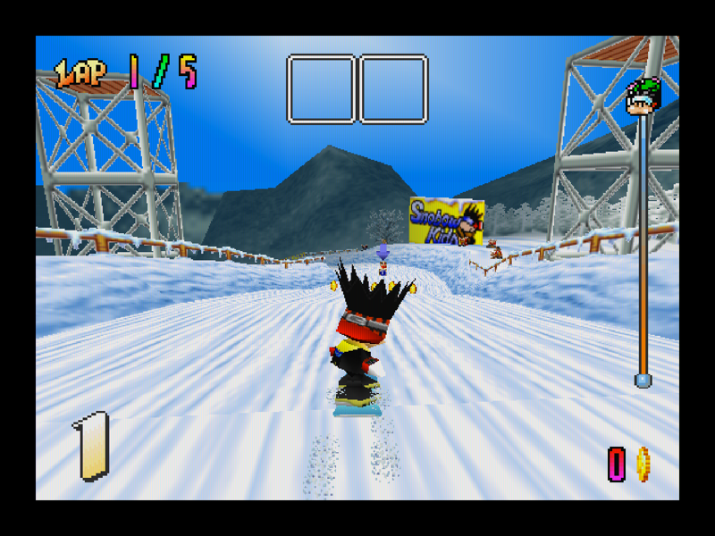
  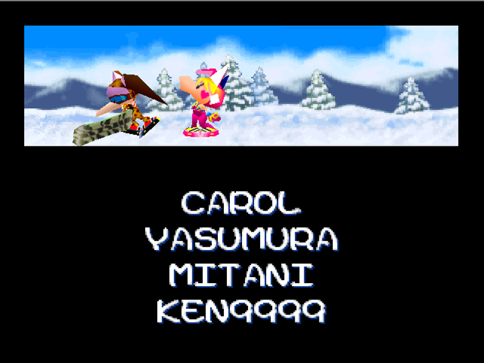

All captured on the G4 itself (Leopard, Radeon 9000): launcher and options,
a race in Enhanced mode, the same game at the N64's 320x240 with scanlines,
2x with the aperture grille, and the ending credits the self-play campaign
reached.

## Status (11 September 2026)

| Milestone | State |
| --- | --- |
| Toolchain: matching ROM build on the Mac, cross compile in Docker | done |
| First frame: boot, threads, DMA, title demo on the real G4 | done |
| Menus and gameplay: every menu, a race on Rookie Mt. | done |
| Controller Pak: 32 KB image, save and load through libultra's own pfs code | done, `controller-pak-1.mpk` in Application Support |
| Audio: aspMain (ABI 1) interpreter feeding SDL at 22050 Hz | done, music and effects play |
| Performance: `--perf` phase timing; a race uses ~6 of 16.7 ms per retrace on the 1 GHz G4 | measured, headroom |
| Self-play: `--autoplay` (CPU drives player 1), `--soak` (also walks menus), `--nightmare` | done |
| Gamepad: SDL game-controller layer, hot-plug, raw fallback with mapping log | built, untested (no pad seen on USB yet) |
| Fullscreen: exclusive mode, 4:3 letterbox, Cmd+Return/Cmd+F/F11 toggle, on by default from the Finder | done |
| Gamepad: SDL game controllers (HID pads) and Xbox One pads over USB via IOKit | done |
| Rumble Pak: the pad's rumble (Xbox GIP packet or SDL haptic) behind osMotorInit/Start/Stop | done |
| Front end: settings file, launcher, in-game options overlay, resolution modes, CRT filters | done, `settings.txt` next to the Controller Pak |

Scripted input is deterministic: `--play` a text script or a Mupen `.m64`
movie, `--record` one from a keyboard session, and two runs of the same script
end on the same frame hash (`--frames N --hashframe`).

## Build and run

    make ...                      # the upstream N64 build first (map, linker script, assets)
    port/build-ppc.sh -j6         # Docker cross build -> port/build-ppc-darwin/snowboardkids
    port/tools/make_bundle.sh     # SnowboardKids.app with the ROM in Resources

    snowboardkids [--fullscreen] [--nolauncher] [--mode=original|enhanced]
                  [--resolution=native|n64|2x] [--filter=none|scanlines|grille|smooth]
                  [--widescreen=4:3|16:9] [--fadein[=0|1]] [--msaa=0|2|4]
                  [--texfilter=rdp|point|bilinear] [--glinfo]
                  [--volume=0..100] [--uiscript SEQ]
                  [--play SCRIPT|MOVIE.m64] [--record MOVIE.m64]
                  [--frames N] [--hashframe] [--mute] [--noaudio] [--wav OUT.wav]
                  [--pak FILE.mpk] [--nopak] [--nopad]
                  [--cmds FILE] [--trace] [--dumpdl N] [--dumpframes N]
                  [--dumptris] [--bigtri N] [--racedbg] [--peek ADDR:LEN] [--perf]
                  [--autoplay] [--soak] [--nightmare] [--trial SPEC]
                  [--status] [--coursetrace] [rom.z64]

Scripts in `scripts/`: `title-start.txt`, `menu-walk.txt` (to mode select),
`race-walk.txt` (through the pak prompts into a race), `race-drive.txt`
(the same, then taps A with the stick forward), `pak-save.txt`. `--cmds FILE`
appends script lines dropped into FILE at runtime, for driving menus step by step.

## Launcher and options

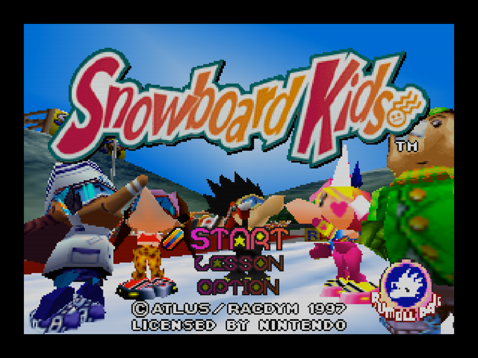

`~/Library/Application Support/SnowboardKids/settings.txt` (next to the
Controller Pak) is a plain `key=value` file:

    game=sbk1          mode=original|enhanced|custom
    draw_distance=1..4 resolution=native|n64|2x
    filter=none|scanlines|grille|smooth
    texfilter=rdp|point|bilinear          msaa=0|2|4
    widescreen=4:3|16:9                   fadein=0|1
    fullscreen=0|1     vsync=0|1
    volume=0..100      launcher=0|1       perf=0|1
    haze=0|1

`widescreen` used to be `0|1` and both spellings still read; everything else
is new with the four rendering options below.

It is read before the command line is parsed, so **every flag still wins for
its own run**: `--drawdistance`, `--wide`, `--windowed`, `--perf`, `--haze[=0|1]` and the
new `--mode=`, `--resolution=`, `--filter=`, `--volume=` all override the file
without writing to it. The launcher and the overlay write it whenever
something changes.

**The launcher** runs on the created window before the game boots: a game
list (Snowboard Kids, plus Snowboard Kids 2 greyed out as *not installed*
until its ROM appears next to the first -- the table in `src/settings.c` is
where a second game registers), **Mode** Original / Enhanced, an **Options**
page with the individual settings, **Start** and **Quit**. Arrows or the
stick move, Enter or A selects, left/right change a value, Esc or B backs out
and quits from the top page.

* **Original** = draw distance 1, `n64` resolution, no filter, no haze, no
  fade-in, no anti-aliasing, `texfilter=rdp`, 4:3.
* **Enhanced** = draw distance 2, `native` resolution, no filter, **haze on**,
  **fade-in on**, **2x anti-aliasing**, `texfilter=rdp`.
* **Widescreen is in neither preset.** It is a framing choice for the screen
  the player owns, not a quality dial, so changing it does not turn ENHANCED
  into CUSTOM.
* Touching any single setting moves Mode to **CUSTOM** rather than lying.

**The overlay** is the same Options page over the running game: **F1** or the
pad's **View** button opens and closes it (View no longer doubles as Start).
It is drawn over the left letterbox bar where one is wide enough and
translucently over the frame otherwise; the game keeps running underneath
with its controller reading as idle, and draw distance, resolution, filter,
texture filter, the far-object fade-in, widescreen, vsync, volume, the
distance haze and the perf readout all apply live. **Anti-aliasing** is the
one row that does not: a multisample count is a pixel-format attribute, so it
is written to the file and taken at the next start.

**Resolution modes** render the frame into a 320x240 (`n64`) or 640x480
(`2x`) viewport, copy it into a power-of-two texture with
`glCopyTexSubImage2D` (no FBO and no NPOT on a Radeon 9000) and draw it
scaled into the 4:3 output rectangle -- `GL_NEAREST`, or `GL_LINEAR` under
`smooth`. `native` is the path that was always there. gfx_pc is untouched:
it asks the window layer for the framebuffer size and that answers with the
render size.

**Filters** are one quad over the output rectangle with the mask mapped
exactly one texel per output pixel, so the period is always a whole number of
pixels and moire is impossible at any window size. `scanlines` is a 1x2 alpha
mask darkening every second line by 35%; `grille` is a 4x1 RGB mask
multiplied in with `GL_DST_COLOR`/`GL_ZERO`. The grille period is 4 rather
than the usual 3 because **a 3x1 texture is NPOT**: on this card that is an
incomplete texture, texturing silently switches off and the quad multiplies
the frame by white. The whole post pass costs 0.3-0.4 ms of `finish_render`
on the G4 and the UI itself a fraction of that.

`--nolauncher` skips the launcher, and so do `--autoplay`, `--soak` and
`--autonav`: an unattended session must never sit on a menu. A **scripted**
run (`--play`, `--record`, `--headless`, `--nolauncher`) goes further: the
settings file is not read at all, the port's own defaults are used and no
filter or resolution change is applied, so a golden replay is bit-identical
whatever the last interactive session chose. Passing `--mode=`,
`--resolution=` or `--filter=` explicitly overrides that ("no filters unless
asked"); `nightmare_search.py` never passes them.

`--uiscript SEQ` drives the launcher and the overlay from a token string
(`u d l r` directions, `a` = A, `b` = B, `m` = the overlay button, `w` = wait
a second), one token every eight ticks. It exists because synthetic key
events from `osascript` do not reach a fullscreen SDL window over SSH, which
is the only way the G4 is driven; every screenshot below was taken with it.

The font is generated: `port/tools/gen_font.py` keeps 128 glyphs as hand-drawn
5x7 pictures and writes `port/src/ui/ui_font.h`; the UI uploads it once as a
128x128 `GL_ALPHA` texture and draws everything as immediate-mode quads
(`port/src/ui/ui_gl.c`). `sbk_ui_begin()` pushes the whole GL state the game
left behind and `sbk_ui_end()` pops it, so gfx_pc's own state cache stays
valid and needs no invalidation.

## Letting it play itself

`--autoplay` hands player 1 to the game's own CPU rider logic as soon as a
race starts, so the game drives every course with the routes it already
knows. `--soak` adds a menu monkey between races (YES-and-confirm, confirm,
START, confirm every 1.5 s) for unattended beta testing; `--nightmare` sets
every CPU rider's item and trick chance to the maximum. `--perf` prints a
per-second line (and puts it in the window title) with the time spent in
game logic, display lists, audio, present and idle, the worst frame, and
triangle / draw / texture-upload counts. `g4 top` shows the machine's load.

## Making the CPU rider win: `--trial`

`--trial course=N,char=N,board=N,action=N,item=N,boost=N,money=N,quit=1` runs
one measured race. At the race's own init (after the game's tuning) player 1 is
re-tuned from the character and board tables with `boost` added to its top
speed in 1/256ths, the item and trick chances are pinned for the whole race,
and one line is printed when player 1 crosses the line:

    sbk-trial: result course=9 char=3 board=2 action=255 item=255 boost=64 \
               rank=1 finished_before=0 frames=13124 money=0

`course=N` aims the character-select course menu. That menu keeps a *cursor
index* into `gCharacterSelectActiveCourseOptions` in `gRaceCourseIndex` and
only converts it to a real course id when it fades out, so the trial parks the
cursor on the wanted course while the list is live and lets the script's own A
press confirm it. Identifying "the list is live" from the port needed
measuring: `gCurrentGameTask` is NULL between dispatches and
`gRacePlayers[0].isActive` is 1 in the menus too, so the tell is
`gRacePlayers[0].menuState == 0` plus the list cursor state (`--coursetrace`
prints both). Raising `gHighestUnlockedCourse` (the game only ever raises it)
puts every course in the list. Course ids are the game's own: **9 is the course
the menu starts on (Rookie Mt.)**, 0-6 are the rest.

`--status` prints the campaign scoreboard (purse, saved purse, progression
level, per-course unlock states) whenever the money changes and once every five
seconds. Progression, from `initRaceStartTransition`: level 1 needs a win on
courses 0-4 and 9, level 2 adds course 5, level 3 adds course 6 and rolls the
ending credits.

`port/tools/nightmare_search.py` drives trials on the G4 headless (~30 s each,
12x real time) and appends to `port/tools/nightmare_results.csv`:

    port/tools/nightmare_search.py run course=0,char=1,board=2
    port/tools/nightmare_search.py sweep 0 1 2 3 4 5 6
    port/tools/nightmare_search.py table       # best setup per course so far
    port/tools/nightmare_search.py record 0    # re-run the winner with --record
    port/tools/nightmare_search.py regress     # replay the golden movies

A trial that has not printed a result after 300 s is hung (a healthy one costs
30-60 s of wall clock); the sweep stops it and carries on rather than blocking.

### Golden movies and `regress`

`record N` replays the best winning row for course N once more with
`--record /Users/zach/golden-courseN.m64`, copies the movie into
`port/scripts/golden/courseN.m64` and writes that run's measurement back into
the CSV row it came from. Because the rider is the game's *own* CPU logic, the
movie holds the menu walk, not the driving: the race is reproduced by replaying
the movie under the same `--trial` spec, which is what `regress` does.

    port/tools/nightmare_search.py regress        # every recorded course
    port/tools/nightmare_search.py regress 0 2    # just these

It prints a pass/fail table: a course passes when the replay finishes with the
same rank *and* the same frame count as the CSV row it was measured from.

    course   spec                             expected       got            result
    9        course=9,char=3,board=2,boost=64 rank=1/13354   rank=1/13354   PASS
    0        course=0,char=1,board=2          rank=1/18062   rank=1/18062   PASS
    1        course=1,char=3,board=2,boost=32 rank=1/25058   rank=1/25058   PASS
    2        course=2,char=1,board=2,boost=64 rank=1/20244   rank=1/20244   PASS
    3        course=3,char=1,board=2,boost=64 rank=1/22976   rank=1/22976   PASS
    4        course=4,char=3,board=1,boost=96 rank=1/21260   rank=1/21260   PASS
    5        course=5,char=3,board=1,boost=64 rank=1/21514   rank=1/21514   PASS
    6        course=6,char=4,board=1,boost=64 rank=1/21876   rank=1/21876   PASS
    8 course(s) checked, 0 failed

#### Goldens need `--nopak --nopad` (2026-09-11)

A trial is only reproducible when nothing outside the script can reach the
game, and two things did:

* **The Controller Pak.** The game writes it while walking the menus, so the
  first run after any pak change took a different path from the next ones. A
  pak-backed run is deterministic only for as long as the pak's contents do not
  change -- which a *saving* run cannot promise. `--nopak` reports no pak at
  all (`osPfsInitPak` fails, the image is never opened or written).
* **The gamepad.** An open pad reports a Rumble Pak through `osMotorInit`,
  which changes the menus' pak prompts, and whether the Xbox One pad can be
  claimed at startup depends on whether the previous process has finished
  letting go of it. That is why replaying *one* movie gave two different races
  in the same afternoon: 20244 frames when the pad was claimed, 21132 when the
  fallback log said "no gamepad; keyboard only". `--nopad` skips gamepad init.

Proof, on the G4: with both flags, three runs of
`course=9,char=3,board=2,boost=64` print 5592 identical
`sbk: retrace N: dma=M` fingerprint lines (one md5) and the same result line;
three replays of the course 2 golden likewise. `regress` then passes 8/8 twice
over. `nightmare_search.py` passes `--nopak --nopad` for every trial
(run/sweep/record/regress); only `campaign` keeps a pak, its own experiment one.

The CSV carries a `mode` column for this: `nopak` rows are the reproducible
measurements the goldens are cut from, `pak` rows are the older numbers taken
with a pak plugged in. `best_row` prefers `nopak` rows wherever a course has
any. Under the new conditions courses 1, 2 and 5 needed a bigger boost than the
pak-era book had (32, 64 and 64).

### What the rider learned (re-measured 2026-09-11 with --nopak --nopad)

Every course in the game has a setup the CPU rider wins with. `boost` is in
1/256ths of the character+board top speed; where it is 0 the stock rider
already wins.

| course | name | char | board | boost | frames |
|---|---|---|---|---|---|
| 9 | Rookie Mountain | 3 | 2 | 64 | 13354 |
| 0 | Big Snowman | 1 | 2 | 0 | 18062 |
| 1 | Sunset Rock | 3 | 2 | 32 | 25058 |
| 2 | Night Highway | 1 | 2 | 64 | 20244 |
| 3 | Grass Valley | 1 | 2 | 64 | 22976 |
| 4 | Dizzy Land | 3 | 1 | 96 | 21260 |
| 5 | Quicksand Valley | 3 | 1 | 64 | 21514 |
| 6 | Silver Mountain | 4 | 1 | 64 | 21876 |

The boost column is not a difficulty dial: because player 1 is a CPU rider it
is rank-handicapped like the rest of the field (see docs/PLAN.md), so a bigger
boost can cost places. Course 3 goes 2nd, 4th, 1st at boost 0, 32, 64.

## Playing the campaign: `--plan` and the driver

`--trial course=-2` aims every race at the first course still unwon, but a
single `--trial` spec cannot carry a different rider for each course.
`--plan COURSE:CHAR:BOARD:BOOST,...` is the rider's book: at each race's init
the port looks up the course the race actually started on and applies that row.
`nightmare_search.py plan` prints the book straight out of the CSV, and
`campaign` starts a session with it on the experiment Controller Pak
(`/Users/zach/trial-pak.mpk` -- never the user's own save):

    port/tools/nightmare_search.py campaign     # start the session
    port/tools/nightmare_search.py drive 60     # walk it through the menus
    port/tools/nightmare_search.py status       # the last sbk-status line

`drive` is the old autopilot (A presses through `--cmds`); the session itself
now steers with `--autonav`.

### `--autonav`: a navigator, not a monkey

The purse only reaches the Controller Pak from the Game Menu's EXIT / SAVE, and
an A-pressing monkey walks from the results screen straight back into the next
race, so the first driven session earned 20,200G and saved none of it.
`port/src/debug/menu_nav.c` fixes that by knowing where it is: it reads the
active screen out of the game's own task list (`gActiveGameTaskList`) and names
each task's callback with `dladdr()`, so `--menutrace` prints lines like

    sbk-menu: r=20454 ms=2 money=3840 tasks: handleRaceRecordSaveOptionsFlow initControllerPakRaceRecordSaveFlow

and the navigator can branch on real function names instead of counting frames.

The map came out of `race_flow.c`. The post-race **Game Menu** is
`updateRaceSplitscreenSelectMenu`, and `gRaceSplitscreenMode` decides what its
A press does:

| mode | goes to |
|---|---|
| 0, 2 | the course list, i.e. the next race |
| 1 | the race type menu |
| 3 | the shop (`initCourseSelectMenu`) |
| 4 | **EXIT / SAVE** (`initControllerPakRaceRecordSaveFlow`) |

So the navigator never counts D-pad presses: it parks the menu's own variable
on the entry it wants and lets A confirm, the same aiming trick `--trial` uses
for the course cursor. The same applies to every choice that defaults to the
answer that backs out -- a queued A lands on a prompt the frame it appears, so
stick-up always arrives too late:

* ARE YOU SURE? -> `gControllerPakMenuState.confirmChoice = 0` (YES)
* DATA SAVE -> `gMenuChoicePromptState[0] = 3` (SAVE; 4 leaves)
* the startup save menu -> `gMenuChoicePromptState[0] = 3` (USE THIS SAVE; 4 is
  a new game, which is why a restarted campaign always began at 0G)

`--saveevery N` saves after every N races (default 1). A screen that has not
changed in 3600 retraces gets a B and, if a purchase was under way, the
purchase is abandoned -- an unattended session must not sit on a menu it does
not understand.

Verified end to end on the G4: three races won, three saves, the pak's note
table carrying a real `NSKE` note, and after `g4 stop` and a fresh start the
session came back up at **money=15470 savemoney=15470 won=1,1,0,...,1** --
earned, saved, reloaded.

**The shop is not the course shop.** `--shop` walks the Game Menu's shop entry,
but the shop it reaches sells **boards** (FREE STYLE / ALL AROUND / ALPINE) and
**paint**, with the third row the way out -- see `g4-shots/shop-stuck.png` and
`shop3.png`. `gCourseUnlockPrices` is spent somewhere else. It costs the
campaign nothing: the port raises `gHighestUnlockedCourse`, every course is
offered, and a win on a course that is still for sale counts -- this session
reached progression level 1 (wins on courses 0-4 and 9) having bought nothing.
So `--shop` is off by default.

**Never press START from the driver.** It is what `--soak`'s monkey does, and a
START still queued when the next race begins *pauses* that race. Worse, the
PAUSE / CONTINUE / QUIT / RETRY overlay does not answer A at all -- only
another START dismisses it -- so the session sits on the overlay forever. The
first Big Snowman run lost 20 minutes of game time to exactly this. `nudge`
sends A and stick-up only.

## Gamepad

HID pads (DualShock 4, most "DirectInput" pads, Xbox 360 with a driver) come
through SDL's game-controller layer. Xbox One pads are not HID: they speak
Microsoft's GIP protocol on a vendor interface and Leopard has no driver, so
`port/src/platform/input_xone.c` talks to the pad itself through IOUSBLib
(interface class ff/47/d0, power-on packets, 64-byte interrupt reports, the
layout the Linux xpad driver documents). The SDL build for this is
`isle-ppc-tools/tiger/build-sdl2-tiger-joy.sh` (joystick + haptic on, an
IOHIDManager shim for the 10.4 SDK).

Mapping: left stick = stick, A = A, B and X = B, Y = C-down (item), triggers
= Z, LB/RB = L/R, Menu/View = Start, D-pad = D-pad, right stick = C buttons.

The Rumble Pak is the pad's own rumble: `osMotorInit` reports a pak on port 1
whenever the pad can rumble, Start/Stop drive it (a GIP rumble packet on Xbox
pads, SDL haptic rumble otherwise). A Controller Pak and a Rumble Pak are both
present at once here, which a real controller cannot do, so every swap prompt
passes immediately.

## Draw distance

`--drawdistance N` multiplies the race projection's far plane (2800 units)
and the camera-distance cull for props and effects. This is the one place the
port changes game code: `port/patches.txt` lists exact-text substitutions
that `tools/mirror_src.py` applies to the mirrored copies at build time
(upstream files are never touched), turning the two constants into
`constant * sbk_far_scale`. Cost at 4x on the G4: about +0.1 ms per frame.

### Distance haze

The extra range is honest geometry, and that is the problem: the N64 clipped
it, so nobody ever made it look like anything. At `--drawdistance 4` a band of
far terrain stands across the sky, hard-edged and fully lit, with clouds
behind it.

`haze=1` (on in **Enhanced**, off in **Original**, `--haze=0|1` for one run)
fades that band into the course's own air. It is not a post-process and not a
shader: F3DEX already carries a per-vertex fog factor, gfx_pc already computes
one for `G_FOG` geometry and `gfx_gl13.c` already hands it to `GL_FOG` as a
per-vertex fog coordinate, which the Radeon 9000 does in fixed function for
nothing. `port/src/gfx/haze.c` fills that same slot in for race geometry the
game did not fog far enough out, and where the game has its own factor for a
vertex the **thicker of the two wins** -- the haze can only add, never take
the game's fog away.

* **Distance** is exact, not estimated. The projection is `guPerspective(...,
  scale = 0.5f)` MUL'd with the view matrices into the same `G_MTX_PROJECTION`
  slot, so a vertex's clip-space *w* is its eye distance times that scale;
  gfx_pc recovers the scale as the length of the matrix's w column, which is
  why the first game's 0.5 and the sequel's 1.0 need no special case.
* **Which viewport** comes from `gSPPerspNormalize`, which is
  `2*65536/(near+far)` and so names the far plane on its own. Only the race
  camera is hazed; the overlay passes (a flat 15000), the menu viewport
  (10000) and Silver Mountain's own race viewport (1000) carry different
  integers and are left alone. `port/patches.txt` tells the port what the race
  far plane came out as; everything else is read off the display list.
* **Colour** is the game's own: `gFadeColorRed/Green/Blue`, set once per
  course by `setBootFadeColor` / `setTitleFadeColor` at the end of each case of
  `initRaceCourseSceneTasks` and fed straight to `gDPSetFogColor` by
  `appendFadeOverlayDisplayList`. It is authored per course and per time of
  day -- `80 C0 FF` for Big Snowman's sky, `FF 80 00` for Sunset Rock,
  `00 00 32` and `00 00 40` for the two night courses, `F0 E6 BE` for
  Quicksand Valley, `20 40 50` for Rookie Mountain's dusk -- so there is no
  table of the port's own and no guessing at the backdrop.
* **Range** runs from 0.85x the far plane the *unmodified* game clipped at to
  2x that distance, capped at the extended plane. Anchoring it to the old
  horizon rather than the new one is the whole trick: the geometry
  `--drawdistance` adds is a band sitting just past where the N64 clipped, not
  something spread over the new range, so a ramp that only reached full haze at
  the new far plane was a few per cent thick exactly where it was needed.
  Nothing the N64 itself drew moves by more than 6%.
* **Props** stop popping for free: the cull range scales with `sbk_far_scale`
  too, so anything appearing at the edge of it appears already deep in haze.

`--hazedbg` prints a line a second: the course, the colour, the range, the
perspNorm the race camera carried against every other perspNorm in the frame,
how many triangles were tinted and the farthest vertex seen. Scripted and
golden runs force it off, like the filters.

## The four Enhanced rendering options

Added 2026-09-13, next to the draw distance and the haze: each has a
`settings.txt` key, a flag, a row in the launcher's Options page and the same
row in the in-game overlay; each is off in **Original**, forced off in a
scripted or golden run, and passed across when one bundle's launcher starts
the other game.

### Far-object fade-in (`fadein`, `--fadein[=0|1]`)

Props, riders, item panels and effects are drawn only while they are inside
the game's own camera-distance cull box
(`isPositionNearCurrentRaceViewportCamera`, `src/math/spatial_math.c`, half
extent 0xBA00000 = 2976 units), so at the edge of it they appear from
nothing. With `fadein` on they fade in across the last 14% of that range
instead.

The port needs two things at draw time and gets both without guessing:

* **The range.** `patches.txt` already scales the cull constant with
  `--drawdistance`; it now also passes it through `sbk_fadein_note_cull`,
  which keeps the number and returns it, so the game's own expression is
  unchanged and the port knows the distance this run really culls at.
* **The object's distance.** The game loads each object's own matrix into
  `G_MTX_MODELVIEW`, so the origin's clip-space *w* is `MP[3][3]` and the
  same w-column scale the haze uses turns it into world units. That is one
  multiply per `G_MTX`, not per vertex, and it is the object's distance, so a
  prop fades as one thing rather than across its own depth.

A terrain sheet running from under the camera out to the horizon can never be
faded: a triangle only fades when *all three* of its vertices are past the
start of the band as well.

The draw itself fades in whichever way is honest for its blender: an opaque
draw gets `glBlendColor` + `GL_CONSTANT_ALPHA` (the Radeon 9000 has
`GL_ARB_imaging` and `GL_EXT_blend_color`), which needs nothing from the
combiner and so works for every one of the game's chains; a draw that is
already alpha-blended keeps its own `GL_SRC_ALPHA` blend and is faded by
scaling the alpha gfx_pc bakes into its vertex stream, so a sprite keeps its
cutout instead of picking up square edges.

**What it is worth in this game, measured rather than assumed: almost
nothing.** `--drawdistance` scales the cull range here, so at 2x and 4x the
box is 5,952 and 11,904 units and no course ever reaches it -- `--fadedbg`
reports `faded 0` for a whole race at 4x. At `--drawdistance 1` the box does
bite (2,559..2,976), 30 to 450 triangles a second fade, and the difference it
makes to a frame is **11 pixels**: the game's own fog is already 83% thick at
that distance, so the objects arriving there are nearly the colour of the air
before the fade touches them. It is kept in Enhanced because it is free
(inside the noise of `--perf`) and correct by construction, and because the
sequel's cull box, which `--drawdistance` does *not* scale, is where the same
code has something real to do.

### Widescreen (`widescreen=4:3|16:9`, `--widescreen=`)

  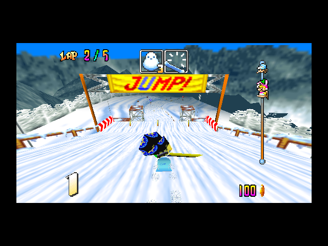
  

16:9 is not a stretch and not a crop. The output rectangle becomes 16:9
(letterboxed in the window or on the screen), and gfx_pc's existing aspect
correction then maps the game's 4:3 frustum onto the middle three quarters of
it -- so the vertical field of view is untouched, nothing is distorted, and
what appears at the sides is scenery the race camera's own projection was
already drawing and the 4:3 frame was cutting off.

Every 2D task goes through the same correction, so the HUD, the menus and the
S2DEX/ortho passes stay a centred 4:3 box. What 2D cannot do on its own is
stop the *3D* passes of a menu screen from showing the sides of a backdrop
built for a 4:3 frame, so a frame that is not a race is scissored back to its
centred 4:3 box.

That decision is made **per frame and not per draw**, and the first attempt
got it wrong in a way worth writing down: keyed on the projection of each
draw, the sky, the HUD and the item overlays -- which hang off their own
viewports -- were clamped inside a race, and the race came out with black
wedges in the top corners where the sky should have been. A draw under the
race camera's projection now only records the fact, and the next frame uses
it; the one frame of lag at the start of a race is behind the game's own
fade-in.

The cull is radial-ish (a square box in XZ around the camera) so the wider
edges need nothing: an object entering from the side was never culled for
being to the side. The `n64` and `2x` resolution modes follow the aspect --
427x240 and 854x480, both still inside the 512 and 1024 power-of-two copy
textures the present pass uses.

### Anti-aliasing (`msaa=0|2|4`, `--msaa=`)

  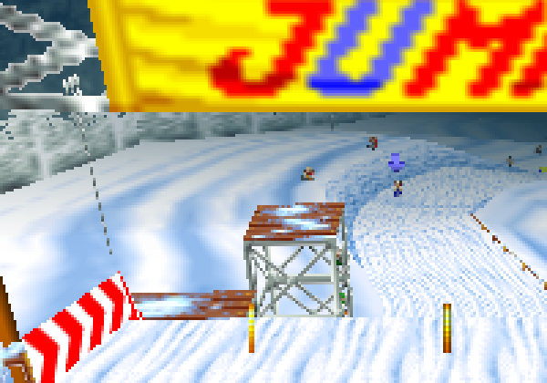
  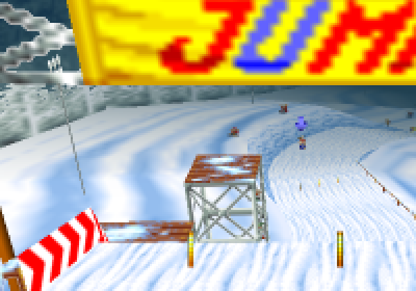

**The Radeon 9000 does have multisample pixel formats**, which was not a
given: `GL_ARB_multisample` is in the extension list, `SDL_GL_MULTISAMPLE-
BUFFERS`/`SAMPLES` are honoured, and the created context comes back with
`GL_SAMPLE_BUFFERS 1`, `GL_SAMPLES 4`. The port asks for the samples before
`SDL_CreateWindow` and reports what it actually got --

    sbk: multisample: asked 4, SDL buffers 1 samples 4
    gfx_gl13: multisample buffers 1 samples 4 -> anti-aliasing ON

-- and if the driver has no format of that size the window creation fails
outright rather than quietly downgrading, so the port retries once without it
and says so. A sample count is a pixel-format attribute, so the row writes
the setting and the **next start** picks it up; changing it live would mean
destroying the GL context under a running game.

It composes with the resolution modes: `glCopyTexSubImage2D` resolves the
multisampled buffer as it copies, so `n64` and `2x` are multisampled at their
own render size and then scaled.

### Texture filtering (`texfilter=rdp|point|bilinear`, `--texfilter=`)

  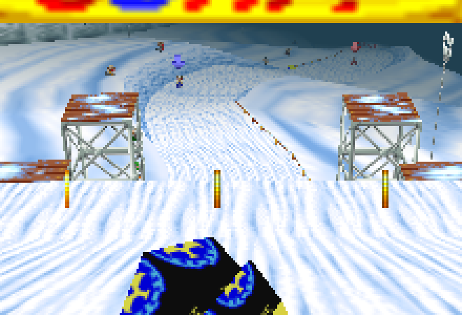
  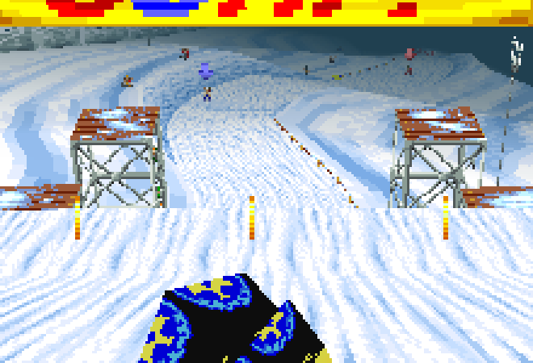

`rdp` (the default) is what the console did: each tile is sampled the way the
game's own `G_SETOTHERMODE_H` asked, point or bilinear. `point` and
`bilinear` force one for every tile -- point brings back the N64-ish crunch on
the snow and the signs, bilinear smooths the handful of tiles the game asks
for point on. The setting is applied in both places the filter shows: the GL
sampler, and the half-texel offset bilinear sampling needs.

**There is deliberately no `n64` three-point mode, because it cannot be done
honestly on this card.** The RDP samples three texels of the texel quad and
weights them by which half of the cell the pixel is in. Without fragment
programs the only fixed-function route is: three texture units sampling the
same texture at one-texel offsets (a texture matrix each), a fourth unit
holding a weight texture indexed by the *fractional* texel coordinate (which
`GL_REPEAT` and a scaled texture coordinate do give you), and then
`T0*w.r + T1*w.g + T2*w.b`. The last step is what kills it: a texture
environment stage multiplies by a whole RGB vector, there is no channel
swizzle, so the three weights cannot be applied to the three samples. The
card does expose `GL_ATI_text_fragment_shader`, and with it the arithmetic
would be expressible -- but that would mean re-implementing the N64 colour
combiner in that shader language for every combiner the game uses, which is a
different renderer, not a filter. So the port ships the two filters it can do
truthfully and says why the third is missing.

### What they cost on the G4

One measured race each -- the course-9 golden movie replayed at real time with
`--perf`, Enhanced (`--drawdistance 2`), 640x480 windowed -- averaged over the
same stretch of retraces (9,200-11,100) in every run, so the same scenery is
being compared:

| run | gfx ms | GL ms | CPU | Hz | tris/frame |
| --- | --- | --- | --- | --- | --- |
| Enhanced, all four off | 2.44 | 0.39 | 35% | 60.0 | 297 |
| + fade-in | 2.48 | 0.39 | 36% | 60.0 | 305 |
| + anti-aliasing 2x | 2.47 | 0.39 | 35% | 60.0 | 304 |
| + anti-aliasing 4x | 2.48 | 0.38 | 35% | 60.0 | 302 |
| + `texfilter=point` | 2.46 | 0.38 | 35% | 60.0 | 302 |
| + widescreen 16:9 | 2.81 | 0.41 | 38% | 60.0 | 369 |

Three of the four are inside the noise. **Anti-aliasing is free on this
machine's clock**, which is the right answer rather than a surprising one: the
multisampling happens in the Radeon, and the port's own work per frame does
not change. Widescreen costs what it says it costs: a wider field of view is
a quarter more triangles, and 0.37 ms more of display-list work to build them.
Every run held 60.0 Hz with two thirds of the frame idle.

## Fullscreen

`--fullscreen` switches the display to its desktop mode and draws the N64
frame as a 4:3 box in the middle (`--fullscreen=1024x768` picks another
mode, `--fullscreen-desktop` uses a borderless window instead, `--wide` is
`--widescreen=16:9` and draws a 16:9 box instead -- see the widescreen option
above). Launching the app from the Finder starts
fullscreen (`SBK_FULLSCREEN=1` does the same from a shell); `--windowed` keeps
the 640x480 window. Cmd+Return, Cmd+F, Option+Return or F11 toggle at runtime.

Note for remote testing: a connected Screen Sharing (VNC) client makes the
VNC server read the fullscreen surface about once a second, which stalls the
swap ~120 ms at 1680x1050 and shows as a flicker on the remote view. The
G4's own display does not have this.

The Controller Pak lives at `~/Library/Application Support/SnowboardKids/controller-pak-1.mpk`,
the raw 32 KB layout emulators use, so saves can move both ways.

`--bigtri N` logs every on-screen triangle covering more than N pixels with the
modelview matrix, the `G_MTX` address it came from and the `G_VTX` source array;
`--dumptris` lines carry the same fields. Looking a `vtx=` address up in
`build/snowboardkids.map` names the game function that drew it. That is how the
"stretched model at an item hit" report was traced to the game's own pickup
shards (see `docs/PLAN.md`) -- the retail ROM in mupen64plus draws the same
panels, so it is not a port bug.

Design notes, survey facts and the gotchas are in `docs/PLAN.md`.

## The sequel

Snowboard Kids 2 has its own port on the same design: the `ppc-port` branch of
[southcitycapture/snowboardkids2-decomp](https://github.com/southcitycapture/snowboardkids2-decomp)
(`port/` there). It boots, walks its menus, saves to an emulated EEPROM and
races on the G4; its one structural difference is run-time code overlays,
handled with generated thunks. The launcher's second slot lights up once that
port plays a full race.

## Licence note

`src/gfx/gfx_pc.c` derives from sm64-port, whose licence allows source
distribution only. Share this branch as source; do not distribute binaries.
